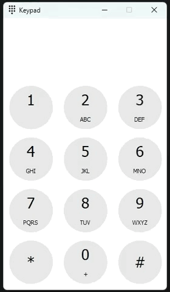

# Keypad App

Keypad App is a PyQt5-based desktop application that emulates a phone keypad, allowing users to input text and see the corresponding phone keypad numbers on the screen. This tool is designed for those who create pin passwords using specific text and need a quick way to convert text to keypad numbers on their PC.


### Building the Application

To build the application into a standalone executable (.exe) file, you can use PyInstaller. Follow these steps:

1. Ensure you have PyQt5 installed.
    ```bash
    pip install PyQt5
    ```

2. **Install PyInstaller**:
    ```bash
    pip install pyinstaller
    ```

3. **Build the .exe file**:
    Open PowerShell and navigate to the project directory, then run the following command:
    ```powershell
    pyinstaller --windowed --onefile --add-data "images/*;images" --icon="images/appicon.ico" keypad.py 
    ```


### Usage

- **Mouse Input**: Click on the buttons to input numbers.
- **Keyboard Input**: Press the keys (1-9, 0, *, #) to input numbers. Use backspace to delete the last digit.
- **Copy to Clipboard**: Press Enter to copy the current number to the clipboard.
- **Exit**: Press Esc to close the application.




### [Download the app](https://github.com/Benediximuss/keypad-app/releases/download/v1.0/keypad_build.zip)
